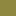

# Introduction
According to the bad themes of any IDE, this project represents customized color schemes for diverse IDEs such as Visual Studio and IntelliJ IDEA.

# Installation
To install these themes, see [here for Visual Studio 2010 (and newer)](https://blogs.msdn.microsoft.com/zainnab/2010/07/15/importing-or-changing-your-environment-settings/), see [here for IntelliJ IDEA](https://stackoverflow.com/questions/39187/how-do-i-install-a-color-theme-for-intellij-idea-7-0-x).

# Dark Theme
The used colors are as follows.  
 _#252525_: Text editor (background)  
 _#252525_: Keywords  
 _#B5CEA8_: Numbers  
 _#BDB76B_: Local variables  
 _#D69D85_: Strings  
 _#FF8C00_: Function declarations and definitions (ctor and dtor too), function calls  
 _#3CB371_: Types, classes, constructor calls, static functions and namespaces  
 _#BD63C5_: Enumerations (macro) and constants  
 _#00FF00_: Global variables  
 _#8F873F_: Parameters  
 _#DADADA_: Literals  
 _#FC3E36_: Syntax errors (underline)  
 _#0E4583_: Braces belonging to another braces (background)  
 _#57A64A_: Comments  
 _#3399FF_: Marked text (background)  
 _#DCDCDC_: Text  
 _#2B91AF_: Line numbers  
 _#B4B4B4_: Operators, operator functions  
 _#D7D700_: Fields  

# Example Screenshot

# Author

This dark theme was developed by Daniel H. based on Visual Studio's default dark theme.
